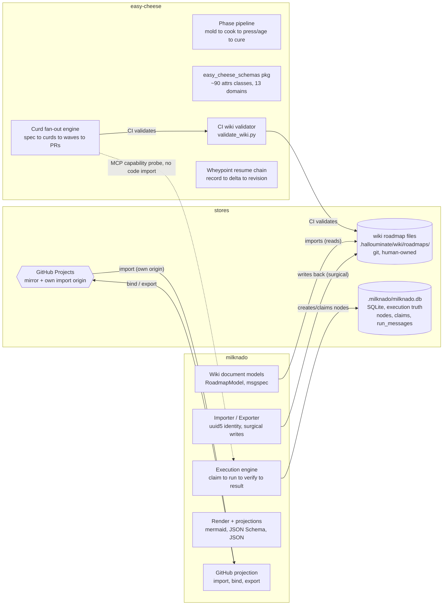
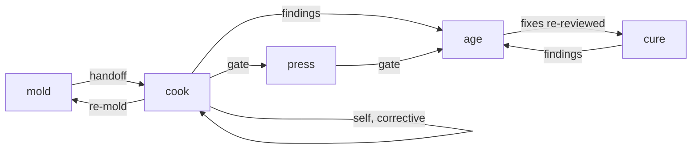
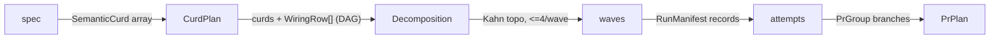
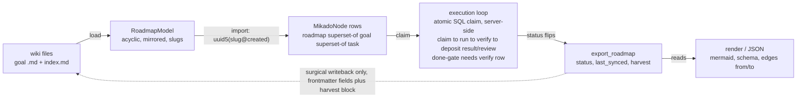
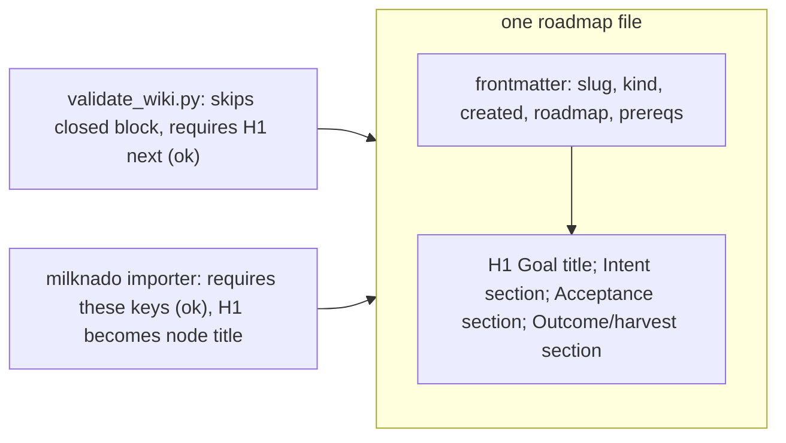

# Graph-flow overview (easy-cheese x milknado)

<certain> Two independent graph systems, joined only at files. easy-cheese runs a phase-transition graph and a curd fan-out graph over specs and code. milknado runs a mikado goal graph over wiki markdown, a SQLite store, and GitHub Projects. Zero code imports in either direction — the seams are a roadmap file format and an MCP capability probe. The format conflict that issue #404 tracks is already resolved and proven empirically below.

Sources: two full-repo traces (2026-08-28) over `/home/paul/Dev/milknado` and `worktree/schemas @ 2c416de`; `.cheese/research/graph-flow-schemas-inventory.md`; live validator + importer runs.

## 1 · The system at a glance

Three stores hold state: the target repo's wiki markdown (git, human-owned), milknado's `.milknado/milknado.db` (execution truth), and GitHub Projects (a mirror with its own import origin). Each machine touches the stores through narrow, mostly one-way paths.

The only bridges: milknado reads/writes the wiki roadmap files that easy-cheese CI validates, and easy-cheese's fan-out probes for milknado MCP tools by name (`shared/fanout/milknado.py:31-60` — classifies `engine` / `tracker` / `none`, degrades silently to native fan-out). Neither package imports the other.

### Who is authoritative, when

| Stage | Authoritative store | Notes |
| --- | --- | --- |
| Authoring, edges, lifecycle | wiki markdown (git) | Human-owned; `Intent`/`Acceptance` preserved byte-for-byte forever |
| After import | `.milknado/milknado.db` | Status, claims, verify gates, results — wiki is stale until export runs |
| GitHub-origin nodes | GitHub Projects | Issue titles imported; bodies deliberately never stored (ADR-2 note, `github/importer.py:8-15`) |
| Bound wiki-origin roadmaps | DB -> GitHub one-way | `export_github_roadmap` mirrors status; never read back after bind |
| easy-cheese pipeline state | `.cheese/<phase>/<slug>.md` + `RunManifest` | Handoffs validated by `TransitionRegistry`; manifest flock-guarded, atomic |
| Session resume | Wheypoint record | Markdown projection is a derived view, never the authority |

## 2 · Two graphs inside easy-cheese

### The phase-transition graph (compiled registry)

Only five sources are compiled into `TransitionRegistry` — the prose pipeline's *culture*, *cut*, and *plate* stops are not in this graph. Cut is gated separately by `GateReceipt`/`red_gate.py`; plate is terminal publication. `_compiled_phase_registry.py:5-105 · phase_contracts.py:25-188`

Every handoff artifact (`.cheese/<phase>/<slug>.md`) is refused unless its (source, destination, payload schema) triple is in this compiled graph — written atomically via tmp + `os.replace`. `write_handoff_artifact.py:41-165`

### The fan-out graph (spec -> waves -> PRs)

Curds must have disjoint files and >=25-line surface; `compute_waves` is a `graphlib` Kahn sort that raises on real cycles. The manifest's own `Phase` enum (gate_approved -> ... -> pr_publish_complete) is a run lifecycle — a deliberately separate vocabulary from the phase graph above. `wiring_graph.py:72-90 · manifest.py:83-175 · curd.py:1-40`

Underneath both: the contracts layer — `@contract`-decorated attrs classes, versioned, with `validate_contract` enforcing exact version equality in both directions (`schema_runtime.py:673-727`) — and the wheypoint chain, an append-only record->delta->revision lineage whose Markdown projection is derived, digest-pinned, and never trusted as authority (`wheypoint/records.py:73-201 · projection.py:59-214`).

## 3 · The mikado lifecycle (milknado)

Import is idempotent — nodes are found-or-created by `wiki_ref = uuid5(roadmap/goal@created)`, so a changed `created` date is a brand-new node. Export never re-renders a file: it sets two frontmatter fields and replaces one fenced harvest block, byte-preserving everything else. `importer.py:52-184 · exporter.py:50-133 · _serialize.py:30-88`

### Status machine & claims

`pending -> running -> {done, failed, blocked, pending} · blocked -> pending · failed -> pending · done is terminal`

- Task claim is one atomic SQL `UPDATE ... WHERE status IN (pending, failed, blocked)` setting `running` + run identity. `_transitions.py:126-139`
- A node cannot go `done` without a persisted `verify` row — the gate is server-side, not agent-honor-system. `_status.py:36-73`
- Goal-level session locks (`claim_goal_row`) serialize whole task-lists per ADR-003. `_goal_claims.py:14-120`

### GitHub Projects: three non-composing one-way ops

- **import** — GitHub -> DB, keyed by `github_ref`; titles only, bodies stay GitHub-owned by design.
- **bind** — one-time push of a wiki-origin roadmap onto a Project (creates Issues, stamps `github_ref`s).
- **export** — DB -> GitHub status mirror; never read back, never touches the wiki.

## 4 · The file-format seam — conflict resolved

Issue #404's premise: the wiki validator demands H1-first, milknado demands frontmatter-first, one file can't do both. That was true at rollback time. It is no longer true: commit `fa07b9d` (#454) taught `validate_wiki.py` to skip a closed leading frontmatter block and require the H1 immediately after it.

One file, both contracts. Proven empirically 2026-08-28: a test roadmap in this exact shape passed `validate_wiki.py` (`OK: validated 2 wiki page(s)`) and imported into milknado (`{"created": 2, "reused": 0}`) — same bytes, both tools.

### Required frontmatter (from the real error path)

| File | Required | Optional |
| --- | --- | --- |
| `index.md` | `slug` · `kind: roadmap` · `created` | `github_project` (owner/number) |
| goal `.md` | `slug` · `roadmap` · `kind: goal` · `created`; active goals also need `## Intent` + `## Acceptance` | `status` · `lifecycle` · `prereqs`/`up`/`down` · `last_synced` |

> **Doc drift, three places:** the wiki page `workflow-contract-map.md:104` and the research inventory still describe the conflict as live; the wiki-roadmap skill's format table omits `slug`/`kind`/`roadmap` as required keys; milknado's ADR-002 says "pydantic" where the code is msgspec.

## 5 · Gaps & open questions

- **unconfirmed — Goal -> task decomposition path.** `plan_batches` is a file-change batcher for one goal's diff, not a goal->task planner. Tasks appear to be added directly as child nodes (`todo_add` / `app/node.py`) — untraced this pass.
- **decision — Coupling.** Keep the seam file-format-only (current design), or add a CI check validating roadmap dirs against milknado's published `roadmap_schema()` JSON — schema-artifact coupling, still zero code imports. The #404 conflict itself (fixed silently, undetected for weeks) is real pressure for that check.
- **one-way** — The two projections never sync with each other: wiki export never touches GitHub; GitHub export never touches the wiki. Both mirror the DB independently.
- **surprise** — *Import* mutates wiki files (`_stamp_missing_created`) — a git write hiding in a read-sounding operation.
- **unconfirmed** — No fan-out dispatcher entrypoint (`cook_cli`-as-dispatcher) located in this checkout — the found `cook_cli.py` is a schema normalize/validate CLI. Moved or external; not confirmed absent.
- **note** — The compiled phase graph covers 5 sources only; cut/culture/plate live outside it by design (GateReceipt / no-write / publication).

## 6 · What we need to do

1. **Correct the stale record** — `workflow-contract-map.md:104`, the research inventory, and the wheypoint handoff: conflict resolved by `fa07b9d`, with the empirical evidence.
2. **Publish the F001/F002 roadmap** under `.hallouminate/wiki/roadmaps/` in the proven dual-valid format; the goal graph content (goals, prereqs, acceptance) is the only real design left — `.cheese/issues/…-F001.md` / `…-F002.md` are the grounding.
3. **Close #404** citing the fix commit and the empirical check.
4. **Decide the coupling question** — recommend: stay file-format-only now; add the CI schema-artifact check as a cheap follow-up.
5. **Trivia sweep** — ADR-002 wording (milknado), wiki-roadmap skill's required-keys table, and trace the goal->task path to close the unconfirmed gap.
