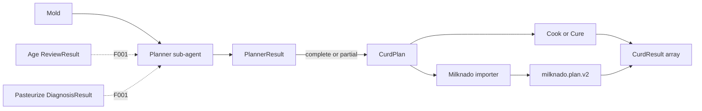

# Workflow contract map

<certain> The contract-map Mold is complete. CurdPlan is the canonical semantic work contract; agents author slim views; the planner owns decomposition; Cook, Cure, and Milknado are executors or adapters around the same semantic plan.[^spec]

## Current implementation state

### Verification boundary: 2026-09-06

The approved flow below is a target, not proof of end-to-end adoption.
This inspection uses Easy Cheese commit `4639f6f5b3dfaf68a195c6d247ef65af57b0debb` from draft PR 628.
The package extraction preserves payload semantics and does not complete the contract redesign.[^extraction-scope]

Current phase declarations send Mold's CurdPlan to Cook and Cook's CurdResult to Press or Age.
Press declares CurdResult output to Age, while Age declares CurdPlan output to Cure.[^declared-routes]
Age's instructions instead prohibit JSON sidecars and require Cure to read Markdown directly.[^age-prose]
These declarations and instructions do not establish one enforced evidence-to-plan handoff.
Do not infer execution support from a registered schema or route alone.

The host knows requested review targets, but it does not know whether the agent reviewed them.
ReviewResultWriterView has no per-target coverage field.
The current workflow marks every target covered for clean or findings output.[^review-observations]
The historical statement that coverage is host-computable does not justify this semantic inference.
A redesign must distinguish host-known target identity from agent-reported coverage.

The owner's clean-break decision supersedes compatibility-only projections and migration requirements in the historical sections.
It does not authorize deletion of stored user work.[^clean-break-boundary]

[^extraction-scope]: .cheese/specs/schema-package-boundary.md:5-39.
[^declared-routes]: skills/mold/phase-contract.yaml:5-10; skills/cook/phase-contract.yaml:5-16; skills/press/phase-contract.yaml:5-10; skills/age/phase-contract.yaml:5-10.
[^age-prose]: skills/age/SKILL.md:241-243.
[^review-observations]: src/easy_cheese_schemas/contracts.py:1969-1976; src/easy_cheese/shared/workflow.py:528-580.
[^clean-break-boundary]: src/easy_cheese_schemas/AGENTS.md:48-54.

Canonical contracts, the compiled registry, and pointer-last publication have implementations.
Mold exposes the publish command, while the broader skill handoffs remain split between typed and Markdown paths.[^implemented-pointer]
CurdBlock, Decomposition, and CurdRecord still have active representations.[^current]

[^implemented-pointer]: src/easy_cheese/shared/publication.py:619-691; src/easy_cheese/skills/mold/contract_handlers.py:65-98; skills/cure/SKILL.md:49-57.

<certain> Milknado still owns a separate batch plan and has no easy-cheese-schemas dependency.[^milknado]

### Current registered-root map

The catalog contains 15 JSON roots, grouped below by their actual boundary.[^root-catalog]
The map includes Python runtime uses and skill instructions; it does not claim every route has end-to-end enforcement.

| Roots | Producer | Consumer and evidence |
| --- | --- | --- |
| PlannerRequest; PlannerResult; CurdPlan | Host request; planner writer; pure materializer | Workflow plan and Mold publication; Cook consumes CurdPlan.[^planning-seams] |
| CurdResult | Cook or Cure writer; host normalizer | Workflow review loop; declared Press and Age inputs.[^execution-seams] |
| ReviewRequest; ReviewResult | Execution host; review writer | Workflow review normalization; Age's direct report path remains Markdown.[^review-seams] |
| DiagnosisRequest; DiagnosisResult | Failed-criterion host; diagnosis writer | Workflow diagnosis and confirmed-cause repair path.[^diagnosis-seams] |
| AgentWriterView | Agent output or host wrapper | Normalization before canonical construction.[^writer-seam] |
| HandoffPointer; NormalizationReceipt | Publication host | Pointer acceptance and reference validation.[^implemented-pointer] |
| PhaseContract | Skill-owned YAML declarations | Build compiler and immutable transition registry.[^declared-routes] |
| CheckpointIntent; WheypointRecord; WheypointRevision | Checkpoint author; Wheypoint commit host | Checkpoint validation, record persistence, and lineage checks.[^continuity-seams] |

The inspected Milknado planning and MCP entrypoints accept PlanChangeManifest with the milknado.plan.v2 stamp.
They decode file changes, solve batches, and apply graph nodes; they do not establish a CurdPlan consumer.[^milknado-entrypoints]
Milknado's PlanResult is an operational summary, not Easy Cheese's semantic PlannerResult.[^milknado-result]
A complete package-wide consumer absence proof and a field-by-field interoperability audit remain outside this pass.

[^root-catalog]: src/easy_cheese_schemas/_schema_catalog.py:5-39.
[^planning-seams]: src/easy_cheese_schemas/planner.py:44-113,144-182; src/easy_cheese/shared/workflow.py:223-243; skills/cook/references/fan-pathway.md:56-99.
[^execution-seams]: src/easy_cheese/shared/workflow.py:748-794,999-1139; skills/cook/phase-contract.yaml:5-16.
[^review-seams]: src/easy_cheese/shared/workflow.py:1043-1057,554-580; skills/age/SKILL.md:235-243.
[^diagnosis-seams]: src/easy_cheese/shared/workflow.py:1079-1097,617-630,810-829.
[^writer-seam]: src/easy_cheese/shared/workflow.py:445-476.
[^continuity-seams]: src/easy_cheese/skills/wheypoint/checkpoint.py:56-64,234-304; src/easy_cheese/skills/wheypoint/commit.py:620-682,792-837; src/easy_cheese/skills/wheypoint/lineage.py:59-142.
[^milknado-entrypoints]: /Users/paul/Dev/milknado/src/milknado/domains/planning/manifest.py:23-38; /Users/paul/Dev/milknado/src/milknado/domains/planning/planner.py:60-150; /Users/paul/Dev/milknado/src/milknado/mcp/server.py:76-101.
[^milknado-result]: /Users/paul/Dev/milknado/src/milknado/domains/planning/planner.py:29-39; src/easy_cheese_schemas/contracts.py:1208-1237.

## Approved contract flow

<certain> Mold proves the first producer path. Age and Pasteurize become evidence producers through F001 rather than creating curds themselves.

## Contract ownership

| Contract | Owns | Excludes |
| --- | --- | --- |
| CurdPlan | Semantic outcome, bounded scope, inputs, outputs, dependencies, checks, bounded shared context | Waves, batches, worktrees, estimates, retries, runtime IDs |
| CurdBlock | Lossless Easy Cheese legacy/physical projection | New semantic authority |
| Decomposition | Lossless migration projection | New semantic authority |
| CurdRecord | Mutable Easy Cheese runtime dispatch state | Semantic curd identity |
| milknado.plan.v2 | Milknado physical batches and execution topology | Semantic acceptance |
| CurdResult | One criterion-led outcome per semantic curd | Scheduler policy |
| ArtifactRef | Validated content identity and integrity | Runtime operation or continuity envelope |
| PhaseContract | Payload schema references and allowed destinations | Payload field definitions |
| TransitionRegistry | Build-compiled global transition validation | Runtime capability availability |

<certain> Root `$cheese` owns orchestration policy and intent; the selected executor owns runtime state. Human configuration outranks an agent request, which outranks executor defaults. Admission records the resolved execution choice and gates on projected cost across retries, reviews, remediation, checkpoints, and runtime capacity.[^checkpoint]

<certain> Raw goals pass through semantic planning, physical planning, batching, and graph construction. An approved `CurdPlan` can enter Milknado directly, bypassing semantic decomposition and cross-curd batching.[^checkpoint]

## Planner semantics

<certain> PlannerRequest discriminates `decompose`, `remediate`, and `replan`. PlannerResult dispositions are complete, partial, no_work, and blocked; invalid output and executor failure remain separate.

<certain> Partial means a fully executable plan plus unresolved omitted work. Uncertainty affecting emitted work, shared constraints, or dependencies makes the planner blocked.

<certain> Semantic IDs are opaque and separate from digests. Replans retain plan identity, increment revision, and record retain/new/derive lineage. Remediation creates a child plan.

<certain> A semantic curd change creates a derived curd identity. Physical placement, wave, batch, node, executor, or model changes do not change curd identity; Easy Cheese and Milknado identities remain separate namespaces.[^checkpoint]

## Agent and artifact boundary

<certain> Agents omit IDs, digests, versions, subject references, criterion IDs, coverage, derivation, and provenance when the host already knows or computes them. Deterministic normalizers create canonical artifacts and reject contradictory writer fields.

<certain> ArtifactRef validates URI policy, SHA-256 digest, size, media type, and optional schema before exposing a resolved `role/path/media_type` agent view.

<certain> New contracts use Draft 2020-12 schemas generated from frozen attrs/cattrs models. Unsupported majors, future minors, and unknown fields reject before execution.

<certain> The approved executable boundary is a canonical `HandoffPointer`. Producers publish payload and optional `NormalizationReceipt` before revealing the pointer; consumers validate every reference and route before exposing an `AcceptedArtifact`. Agent writer views may receive only bounded syntax recovery, while canonical artifacts and bare persisted inputs remain strict.[^boundary-spec]

## Evidence and execution

<certain> ReviewResult has typed findings and a coverage ledger; an empty finding list is clean only with complete coverage.

<certain> Taste Test and Age are typed review variants. Review batches correlate items by stable identity rather than array position and preserve successful results when another item fails.[^checkpoint]

<certain> DiagnosisResult has symptom, reproduction, hypotheses, optional confirmed cause, regression seam, and unresolved evidence. A diagnosis without a confirmed cause does not dispatch Cure work.

<certain> Cook and Cure consume CurdPlan directly after transport resolution. CurdResult has exactly one row per criterion and one result per semantic curd.

<certain> Milknado maps one semantic curd to one or more physical nodes, then aggregates every node outcome, including unstarted nodes, back into the source CurdResult.

## Routing boundary

<certain> Domain JSON Schemas and phase routing are separate. Phase-local YAML declarations compile into TransitionRegistry at build time; runtime helpers load the compiled registry and do not parse source YAML.

<certain> This supersedes the older runtime-YAML registry decision and declaration location while preserving legacy persisted YAML as migration evidence.[^old-adr]

## Implementation order

1. Canonical contracts, deterministic schemas, validators, normalizers, and fixtures.
2. Mold -> Planner -> CurdPlan -> Cook -> CurdResult.
3. Lossless legacy projections and compiled transition registry.
4. Publish the package and fixtures.
5. Add the Milknado dependency and import CurdPlan.
6. Map to plan v2 and aggregate CurdResult arrays.
7. Run shared conformance and record the boundary reassessment.
8. Complete F001 and F002 separately.

## Deferred goals

<certain> F001, legacy adoption closure, is prepared at `.cheese/issues/workflow-contract-milknado-seam-F001.md`. It covers Age, Pasteurize, Cure, remaining skills, and Decomposition retirement.

<certain> F002, execution continuity protocol, is prepared at `.cheese/issues/workflow-contract-milknado-seam-F002.md`. It covers OperationInvocation, checkpoints, recovery, WorkAttempt, and WorkTask.

<certain> Wiki-roadmap publication was attempted and rolled back. Milknado's importable roadmap format requires YAML frontmatter, while the current repository wiki validator rejects any page whose first non-blank line is not an H1.[^roadmap-format]

## Related

- [Fan-out engine entities](../fanout-engine-entities.md)
- [Cross-skill work contract](../specs/cross-skill-work-contract.md)
- [CurdPlan authority ADR](../adr/workflow-contract-milknado-seam-001.md)
- [Agent writer-view ADR](../adr/workflow-contract-milknado-seam-002.md)
- [Planner ownership ADR](../adr/workflow-contract-milknado-seam-003.md)
- [Executor result ADR](../adr/workflow-contract-milknado-seam-004.md)
- [Routing boundary ADR](../adr/workflow-contract-milknado-seam-005.md)
- [Adoption-order ADR](../adr/workflow-contract-milknado-seam-006.md)
- [Enforceable skill boundaries](../specs/enforceable-skill-boundaries.md)
- [Pointer protocol ADR](../adr/skill-boundary-protocol-001.md)
- [Normalization boundary ADR](../adr/skill-boundary-normalization-002.md)
- [Bundle authority ADR](../adr/skill-bundle-authority-003.md)
- [Legacy adapter lifecycle ADR](../adr/legacy-adapter-lifecycle-004.md)

[^spec]: `/home/paul/.local/share/cheese/paulnsorensen-easy-cheese/specs/workflow-contract-milknado-seam.md`.
[^current]: `src/easy_cheese_schemas/curd.py:132-148`; `src/easy_cheese_schemas/decomposition.py:39-43`; `src/easy_cheese_schemas/manifest.py:328-358`; `skills/cook/SKILL.md:44-56`; `skills/cure/SKILL.md:10-16`; `skills/pasteurize/SKILL.md:184-210`.
[^milknado]: `/home/paul/Dev/milknado/pyproject.toml:5-24`; `/home/paul/Dev/milknado/src/milknado/domains/batching/change.py:32-40,74-77`.
[^old-adr]: [Cross-skill handoff ADR](../adr/cross-skill-work-contract-002.md); [bundled YAML runtime ADR](../adr/cross-skill-work-contract-003.md).
[^roadmap-format]: `/home/paul/.agents/skills/wiki-roadmap/SKILL.md:27-39`; `.github/scripts/validate_wiki.py:48-57`.
[^checkpoint]: `.cheese/notes/root-cheese-milknado-orchestration.md` at `d7bd4267871e6f5e360225a5ebed8e4eb9cd3fce`:37-65,94-103; ingested before tracked source removal on 2026-08-23.
[^boundary-spec]: `.cheese/specs/enforceable-skill-boundaries.md`.

_Source: approved workflow-contract-milknado-seam Mold, 2026-08-07; enforceable-skill-boundaries Mold, 2026-08-24 · Updated: 2026-08-24 · Supersedes: July checkpoint plan-ID and schema-substrate claims where they conflict with accepted August contracts._
