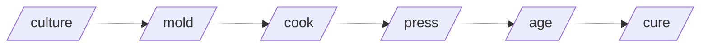

# 🧀 easy-cheese

A skills plugin for [Claude Code](https://docs.claude.com/claude-code) — the cheese-making pipeline for code review, implementation, refactoring, and PR rescue.

[](https://github.com/paulnsorensen/easy-cheese/actions/workflows/validate.yml)
[](https://github.com/paulnsorensen/easy-cheese/blob/main/LICENSE)
[](https://github.com/paulnsorensen/easy-cheese/releases/latest)

## Why cheese?

Two reasons:

1. **Cheese is a metaphor for the workflow.** Code starts as fresh milk (an idea), gets cultured (research), molded (spec'd), cooked (implemented), pressed (hardened with tests), aged (reviewed), and cured (fixed). Each phase has a skill.
2. **Cheese is delicious.** And so is shipping software you trust.

## The pipeline



Each skill is independently invocable — you don't have to run the full pipeline.

## Quick start

```bash
# Install the plugin into Claude Code
curl -fsSL https://raw.githubusercontent.com/paulnsorensen/easy-cheese/main/scripts/install.sh | bash
```

See [Install](install.md) for per-user, per-project, and custom install layouts.

## Skills at a glance

| Skill                          | When to use                                                       |
| ------------------------------ | ----------------------------------------------------------------- |
| [`/cheese`](skills/cheese.md)  | Unified entry point — routes any input to the right skill         |
| [`/culture`](skills/culture.md) | Deep codebase exploration, no writes                              |
| [`/mold`](skills/mold.md)      | Shape a fuzzy idea into a written spec                            |
| [`/cook`](skills/cook.md)      | Implement an approved spec via TDD                                |
| [`/press`](skills/press.md)    | Harden tests after `/cook`                                        |
| [`/age`](skills/age.md)        | Nine-dimension code review                                        |
| [`/cure`](skills/cure.md)      | Apply selected fixes from an age report                           |
| [`/ultracook`](skills/ultracook.md) | Full autonomous pipeline (cook → press → age → cure → …)     |
| [`/melt`](skills/melt.md)      | Resolve merge / rebase / cherry-pick conflicts structurally        |
| [`/hard-cheese`](skills/hard-cheese.md) | Metacognitive review gate before sharing code                       |

Browse the full [Skills index](skills/index.md) for every skill, its triggers, and inputs/outputs.

## Project links

- [GitHub repository](https://github.com/paulnsorensen/easy-cheese)
- [Contributing guide](contributing.md)
- [Security policy](security.md)
- [Code of conduct](code-of-conduct.md)
- [Releases](https://github.com/paulnsorensen/easy-cheese/releases)
