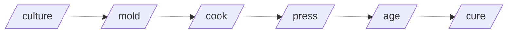

# 🧀 easy-cheese

A set of harness-agnostic [Agent Skills](https://agentskills.io) — the cheese-making pipeline for code review, implementation, refactoring, and PR rescue.

[](https://github.com/paulnsorensen/easy-cheese/actions/workflows/validate.yml)
[](https://github.com/paulnsorensen/easy-cheese/blob/main/LICENSE)
[](https://github.com/paulnsorensen/easy-cheese/releases/latest)

**Don't know what to do? Just `/cheese` it.**

## The pipeline



Each skill is independently invocable — you don't have to run the full pipeline. Drop into `/cheese` if you're not sure where to start.

## Get started

```bash
gh skill install paulnsorensen/easy-cheese
```

That's the portable path. macOS users who want the surrounding ecosystem (CLI tools + MCP servers) in one shot can use the bootstrap script. See [Install](install.md) for every install path, MCP server setup, and CLI tool setup.

## Skills

Browse the [Skills index](skills/index.md) for the full catalogue — every skill with its triggers, inputs, and outputs. Each one is independently invocable, by slash command or plain-English description.

## Project links

- [GitHub repository](https://github.com/paulnsorensen/easy-cheese)
- [README](readme.md) — long-form overview, scope, optional tools, credits
- [Contributing guide](contributing.md)
- [Security policy](security.md)
- [Code of conduct](code-of-conduct.md)
- [Releases](https://github.com/paulnsorensen/easy-cheese/releases)
