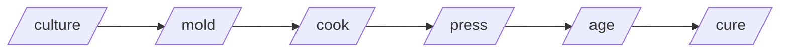

A set of harness-agnostic [Agent Skills](https://agentskills.io) — the cheese-making pipeline for code review, implementation, refactoring, and PR rescue.

[](https://github.com/paulnsorensen/easy-cheese/actions/workflows/validate.yml)
[](https://github.com/paulnsorensen/easy-cheese/blob/main/LICENSE)
[](https://github.com/paulnsorensen/easy-cheese/releases/latest)

**Don't know what to do? Just `/cheese` it.**

## The pipeline



Each skill is independently invocable — you don't have to run the full pipeline. Drop into `/cheese` if you're not sure where to start.

## Get started

```bash
npx skills@latest add paulnsorensen/easy-cheese
```

Pick the skills and agents you want in the installer, then start with
`/cheese` if you want routing help. The skills CLI supports project-local and
user-wide installs; see [Install](install/) for global install flags, Codex
examples, every install path, MCP server setup, and CLI tool setup. macOS users
who also want the surrounding ecosystem (CLI tools + MCP servers) in one shot
can use the optional bootstrap script.

## Skills

Browse the [Skills index](skills/) for the full catalogue — every skill with its triggers, inputs, and outputs. Each one is independently invocable, by slash command or plain-English description.

## Project links

- [GitHub repository](https://github.com/paulnsorensen/easy-cheese)
- [README](readme/) — long-form overview, scope, optional tools, credits
- [Contributing guide](contributing/)
- [Security policy](security/)
- [Code of conduct](code-of-conduct/)
- [Releases](https://github.com/paulnsorensen/easy-cheese/releases)
